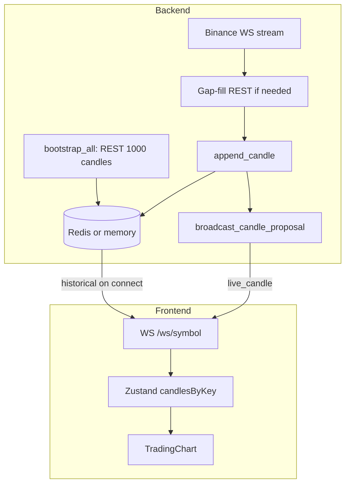

# App data flow verification

This document describes the verified end-to-end data flow: backend bootstrap and Binance live stream into Redis, then frontend WebSocket connection and how live data is streamed from backend to Next.js and Zustand.

---

## 1. Backend: REST bootstrap then Redis

- **On backend startup** ([backend/app/main.py](backend/app/main.py) lifespan): `bootstrap_all()` runs first.
- **Bootstrap** ([backend/app/binance_ws.py](backend/app/binance_ws.py)): For each `(symbol, interval)` in SYMBOLS x INTERVALS, the backend calls **Binance REST** `GET .../klines?symbol=X&interval=Y&limit=1000` (line 68, `limit=1000`). The response is written to the store via `set_candles(symbol, interval, candles)` (line 87).
- **Store** ([backend/app/redis_store.py](backend/app/redis_store.py)): Writes to **Redis** (or in-memory dict when `USE_MEMORY_STORE` is set). Key format: `candles:{SYMBOL}:{interval}` (e.g. `candles:BTCUSDT:1m`). `BUFFER_SIZE` is 1000 ([backend/app/config.py](backend/app/config.py)).

**Summary:** Backend requests 1000 candles per symbol/interval via REST, then stores them in Redis (or memory).

---

## 2. Backend: Binance WebSocket live, gap-fill, then Redis + broadcast

- After bootstrap, the backend starts **Binance WebSocket** in the same lifespan: `run_binance_ws()` ([backend/app/binance_ws.py](backend/app/binance_ws.py)).
- It connects to Binance **combined kline stream** (all configured symbols/intervals). On each kline message:
  1. **Gap-fill**: If the new candle time is ahead of the last stored candle by more than one interval, the backend fetches the missing range from **Binance REST** (`fetch_klines_range`) and appends those candles to the store (lines 211–227).
  2. **Append live candle**: `append_candle(symbol, interval, candle)` writes the new candle to Redis (line 237).
  3. **Broadcast to frontends**: `broadcast_candle(...)` and `broadcast_candle_proposal(...)` ([backend/app/ws_broadcast.py](backend/app/ws_broadcast.py)) send the same candle to every **frontend WebSocket** client subscribed to that `(symbol, interval)`.

**Summary:** Binance live -> backend (gap-fill via REST if needed, append to Redis, then push to all subscribed frontend WS connections).

---

## 3. Frontend: Request symbol via backend WebSocket (not Binance)

- When the user selects a symbol, the **Next.js** app mounts `TradingChart` with that symbol. Inside it, [app/hooks/useCandles.ts](app/hooks/useCandles.ts) runs.
- The frontend opens a **WebSocket to your backend**: `ws://localhost:8000/ws/{symbol}` (e.g. `/ws/ETHUSDT`). This is your **backend's** WebSocket endpoint, not Binance's.
- **On connect**, the backend ([backend/app/main.py](backend/app/main.py) `websocket_proposal`, line 817):
  1. Reads up to 720 candles from **Redis** for that symbol: `get_candles(symbol, "1m", limit=720)`.
  2. Sends **one** message: `{ type: "historical", symbol, data: [...] }`.
  3. Registers this connection as a **proposal subscriber** for that symbol: `subscribe_proposal(websocket, symbol, "1m")`.
- The frontend receives the `historical` message and writes it to **Zustand** with `setCandlesForSymbol(normSymbol, interval, toStoreCandles(normalized))` ([app/hooks/useCandles.ts](app/hooks/useCandles.ts) lines 269–273).

**Summary:** Frontend connects to backend WS `/ws/{symbol}` -> backend sends historical from Redis -> frontend stores it in Zustand. There is no request body; the symbol is in the path.

---

## 4. How live data reaches Next.js

1. **Binance** sends a kline update to the **backend** (Binance WebSocket in `run_binance_ws`).
2. Backend **gap-fills** (REST if needed), then **appends** the candle to **Redis** (`append_candle`).
3. Backend **immediately** calls `broadcast_candle_proposal(symbol, interval, candle)`, which sends a `live_candle` JSON message to **every frontend WebSocket** subscribed to that `(symbol, interval)` (those that connected to `/ws/{symbol}` and received historical).
4. **Frontend** receives the message in `ws.onmessage` ([app/hooks/useCandles.ts](app/hooks/useCandles.ts) line 276): `if (data.type === 'live_candle')` -> normalizes the candle -> `mergeCandle(normSymbol, interval, storeCandle)` updates **Zustand** (append or update by time).
5. **React** re-renders because the store changed; `TradingChart` reads candles from the hook (which reads from Zustand) and the chart library updates (e.g. `setData` or `update`).

**Summary:** Backend, after writing live data to Redis, streams the same candle to the frontend over the existing WebSocket; the frontend stores it in Zustand and the UI re-renders. There is no second "read from Redis" step for live data: the backend pushes each new candle as it is written.

---

## End-to-end diagram

---

## Summary table

| Step | Description | Verified |
|------|-------------|----------|
| Backend REST 1000 candles | Backend requests REST, stores in Redis | Yes. `bootstrap_all()` -> Binance REST klines limit=1000 -> `set_candles` -> Redis. |
| Backend Binance WS live | Merge/gap-fill -> store in Redis | Yes. `run_binance_ws` -> gap-fill (REST) -> `append_candle` -> Redis, then broadcast. |
| Frontend request symbol | Via backend WS, backend gives data from Redis | Yes. Frontend connects to backend WS `/ws/{symbol}`; backend sends historical from Redis and frontend stores in Zustand. |
| Live data to Next.js | Backend fills Redis then streams to frontend -> Zustand -> render | Yes. Each new candle: append to Redis -> `broadcast_candle_proposal` -> frontend receives `live_candle` -> `mergeCandle` into Zustand -> React/chart re-render. |

**Note:** The frontend WebSocket is your **backend's** endpoint (`/ws/{symbol}`), not Binance's. The backend is the only process talking to Binance (REST + WS); it then streams to the browser over the same WebSocket connection used for historical.
