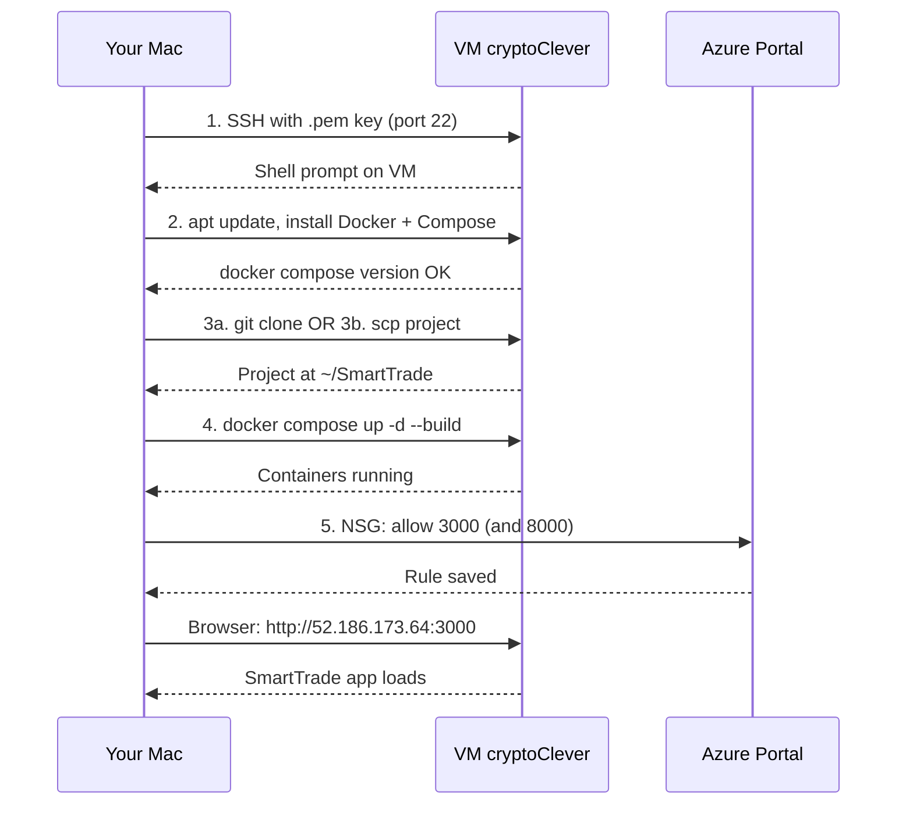

# Access VM, Install Docker, and Deploy SmartTrade (Zero Experience)

This guide assumes you are on a **Mac**, your VM is **cryptoClever** with public IP **52.186.173.64**, and you use the username **azureuser** with an SSH key (`.pem` file) you downloaded when creating the VM.

---

## Phase 1: Access the VM from your Mac (SSH)

**Goal:** Open Terminal on your Mac and get a command prompt *inside* the VM.

### Step 1.1 – Find your private key file

When you created the VM, Azure (or the Azure portal) let you download a **private key** file. It is usually named something like:

- `cryptoClever_key.pem`, or
- `id_rsa`, or
- a name you chose (e.g. `myvm_key.pem`)

Find this file on your Mac (e.g. in **Downloads**). Remember its full path, e.g.:

- `/Users/YourMacUsername/Downloads/cryptoClever_key.pem`

We will call this path `YOUR_KEY_PATH` in the next steps.

### Step 1.2 – Open Terminal

- Press **Cmd + Space**, type **Terminal**, press **Enter**.
- A window with a black or white background and text will open. You type commands there and press **Enter** to run them.

### Step 1.3 – Put the key in a simple place (optional but easier)

Run these two commands **one at a time** (replace `YOUR_KEY_PATH` with the real path from Step 1.1):

```bash
mkdir -p ~/keys
cp YOUR_KEY_PATH ~/keys/cryptoClever_key.pem
```

Example if the key is in Downloads and named `cryptoClever_key.pem`:

```bash
cp ~/Downloads/cryptoClever_key.pem ~/keys/cryptoClever_key.pem
```

### Step 1.4 – Fix key permissions (one time)

SSH will refuse to use the key if permissions are wrong. Run:

```bash
chmod 600 ~/keys/cryptoClever_key.pem
```

Type it exactly and press **Enter**. You will not see any output if it succeeds.

### Step 1.5 – Connect to the VM

Run:

```bash
ssh -i ~/keys/cryptoClever_key.pem azureuser@52.186.173.64
```

- The first time, you may see a message like "Are you sure you want to continue connecting?" — type **yes** and press **Enter**.
- If it works, your prompt will change to something like `azureuser@cryptoClever:~$`. You are now **inside** the VM. All following steps until Phase 4 are done **inside this SSH session**.

If you see "Permission denied" or "Could not resolve host", double-check: key path, `chmod 600`, IP address, and that you are using `azureuser` (or the username Azure shows on the Connect page).

---

## Phase 2: Install Docker and Docker Compose on the VM

**Goal:** Install Docker Engine and the Docker Compose plugin so you can run your app in containers. All commands below are run **on the VM** (after SSH).

You can either run the commands manually (Steps 2.1–2.4) or use the automated script (see **Option: Run the setup script** at the end of this section).

### Step 2.1 – Update the system

```bash
sudo apt-get update && sudo apt-get upgrade -y
```

Enter your VM user password if asked. Wait until it finishes.

### Step 2.2 – Install Docker (official method)

Run these blocks **one after the other**:

```bash
sudo apt-get install -y ca-certificates curl
sudo install -m 0755 -d /etc/apt/keyrings
sudo curl -fsSL https://download.docker.com/linux/ubuntu/gpg -o /etc/apt/keyrings/docker.asc
sudo chmod a+r /etc/apt/keyrings/docker.asc
```

```bash
echo "deb [arch=$(dpkg --print-architecture) signed-by=/etc/apt/keyrings/docker.asc] https://download.docker.com/linux/ubuntu $(. /etc/os-release && echo "$VERSION_CODENAME") stable" | sudo tee /etc/apt/sources.list.d/docker.list > /dev/null
sudo apt-get update
```

```bash
sudo apt-get install -y docker-ce docker-ce-cli containerd.io docker-buildx-plugin docker-compose-plugin
```

### Step 2.3 – Allow your user to run Docker without `sudo`

```bash
sudo usermod -aG docker $USER
```

Then **log out and log back in** to the VM so the group change applies:

```bash
exit
```

Reconnect with the same SSH command as in Step 1.5:

```bash
ssh -i ~/keys/cryptoClever_key.pem azureuser@52.186.173.64
```

### Step 2.4 – Check that Docker works

```bash
docker run hello-world
docker compose version
```

You should see "Hello from Docker!" and a Compose version line. If both work, Docker and Docker Compose are ready.

### Option: Run the setup script

If you have already copied or cloned the SmartTrade repo onto the VM, you can run the provided script to do Phase 2 for you:

```bash
cd ~/SmartTrade
chmod +x scripts/vm-install-docker.sh
./scripts/vm-install-docker.sh
```

Then **exit** and **reconnect** via SSH so the `docker` group is applied, and continue with Phase 4.

---

## Phase 3: Get your app code onto the VM

**Goal:** Have the SmartTrade project (with [docker-compose.yml](../docker-compose.yml)) on the VM so you can run it.

**Option A – Clone from GitHub (recommended if your code is in a repo)**

1. On the VM, install git if needed:
   ```bash
   sudo apt-get install -y git
   ```
2. Clone your repo (replace with your real repo URL):
   ```bash
   git clone https://github.com/YOUR_USERNAME/SmartTrade.git
   ```
3. Go into the project:
   ```bash
   cd SmartTrade
   ```

**Option B – Copy from your Mac (if the code is only on your laptop)**

From your **Mac** (open a **new** Terminal window, do not close the SSH session), run (replace `YourMacUsername` and the path if your project is elsewhere):

```bash
scp -i ~/keys/cryptoClever_key.pem -r /Users/YourMacUsername/Desktop/SmartTrade azureuser@52.186.173.64:~/
```

Then on the **VM** (back in the SSH session):

```bash
cd ~/SmartTrade
```

---

## Phase 4: Run the app with Docker Compose

**Goal:** Start frontend, backend, and Redis with one command.

All of this is run **on the VM**, inside the project folder (e.g. `~/SmartTrade`).

### Set backend URL for the browser

The app’s client (browser) must reach the backend API at a URL the browser can access. On the VM, create a `.env` file in the project root so the frontend build uses your VM’s public URL:

1. On the VM, in the project directory (e.g. `~/SmartTrade`), create `.env`:
   ```bash
   echo 'NEXT_PUBLIC_BACKEND_URL=http://52.186.173.64:8000' > .env
   ```
   Replace `52.186.173.64` with your VM’s public IP if it is different.
2. Then run `docker compose up -d --build` (Step 4.1) so the frontend image is built with this URL. Charts and live data will work in the browser.

If your VM IP changes later, update `.env` and run `docker compose up -d --build` again.

### Step 4.1 – Build and start containers

```bash
cd ~/SmartTrade
docker compose up -d --build
```

- `--build` builds the images; `-d` runs them in the background.
- Wait until it finishes (first time can take several minutes).

### Step 4.2 – Check that containers are running

```bash
docker compose ps
```

You should see three services (e.g. frontend, backend, redis) with state "Up".

### Step 4.3 – Open the app in your browser

- **Frontend:**
  `http://52.186.173.64:3000`
- **Backend API (optional):**
  `http://52.186.173.64:8000`

If the page does not load, see Phase 5 (firewall/NSG).

---

## Phase 5: If the app does not load (firewall and Azure NSG)

**On the VM – allow ports in the Linux firewall:**

```bash
sudo ufw allow 22
sudo ufw allow 3000
sudo ufw allow 8000
sudo ufw --force enable
sudo ufw status
```

**In Azure Portal – allow port 3000 (and 8000 if you want the API reachable):**

1. Open the Azure portal and go to your VM **cryptoClever**.
2. Under **Networking** (or **Settings → Networking**), open the **Network security group** linked to the VM.
3. **Inbound security rules** → **Add rule**:
   - Source: Any (or your IP)
   - Source port: *
   - Destination: Any
   - Service: Custom
   - Destination port ranges: **3000** (and **8000** if you want to call the API from the internet)
   - Protocol: TCP
   - Action: Allow
   - Name: e.g. Allow-3000
4. Save. After a short wait, try `http://52.186.173.64:3000` again.

---

## Flow overview



---

## Quick reference

| What | Command or URL |
|------|------------------|
| Connect to VM (from Mac) | `ssh -i ~/keys/cryptoClever_key.pem azureuser@52.186.173.64` |
| Key permissions (one time) | `chmod 600 ~/keys/cryptoClever_key.pem` |
| Reconnect after logout | Same as "Connect to VM" |
| App URL | `http://52.186.173.64:3000` |
| Stop app on VM | `cd ~/SmartTrade && docker compose down` |
| Start app again | `cd ~/SmartTrade && docker compose up -d` |
| View logs | `cd ~/SmartTrade && docker compose logs -f` |

---

## Optional later steps (not in this plan)

- Use **Nginx** as a reverse proxy and **Let's Encrypt** for HTTPS so the app is served on port 80/443 with a domain.
- Use **systemd** or a cron job to start Docker Compose on VM reboot.
