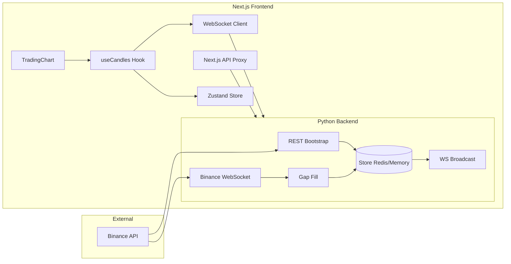

# SmartTrade / CryptoClever — HLD & LLD Report

## Candle Data Flow: Binance → Backend → Next.js

This document describes the **High-Level Design (HLD)** and **Low-Level Design (LLD)** of the application, with emphasis on **how candle data is pulled from Binance, stored, gap-filled, and delivered to the Next.js frontend**. It is intended to support adding a **new API endpoint for forex candles** so that **Binance and forex data remain in sync** and work together.

---

## 1. High-Level Design (HLD)

### 1.1 System Overview

- **Backend (FastAPI):** Single process. On startup it bootstraps candle history from Binance REST, then runs a long-lived Binance WebSocket task. All candle writes go through a **sync-before-broadcast** step: before appending each new candle, the backend checks for gaps and fills them from Binance REST, then appends the new candle and broadcasts to frontend clients.
- **Store:** Single source of truth per symbol/interval. Key format: `candles:SYMBOL:interval` (e.g. `candles:BTCUSDT:1m`). Implemented as Redis or in-memory dict (`USE_MEMORY_STORE`).
- **Frontend (Next.js):** Uses **useCandles** (WebSocket to backend `/ws/BTCUSDT`) for **historical on connect + live updates**. Optionally **useBackendCandlesLoader** polls REST every 30s for BTC 1m to refresh/recover. Chart reads from Zustand `btcCandles`.

### 1.2 Candle Data Flow (End-to-End)

1. **Bootstrap (once at backend start)**  
   For each configured symbol/interval, backend calls Binance REST klines (limit 1000), then **replaces** the store buffer for that key with `set_candles(symbol, interval, candles)`.

2. **Live stream (continuous)**  
   Backend connects to Binance combined kline stream. For each kline message:
   - Parse symbol/interval and convert to internal candle format.
   - **Gap-fill:** Read current store; if empty, bootstrap; if last candle time is more than one interval behind the new candle time, fetch missing range from Binance REST and **append** those candles, then append the new candle.
   - **Append** the new candle (or update existing by time).
   - **Broadcast** to all WebSocket clients subscribed to that (symbol, interval).

3. **Frontend**  
   - **useCandles:** Connects to backend `GET /ws/BTCUSDT` (proposal API). On connect, backend sends `historical` (e.g. 720 candles), then sends `live_candle` for each new candle. Frontend sets/merges into Zustand `btcCandles`. Chart uses this.
   - **useBackendCandlesLoader:** Periodically fetches `GET /candles/BTCUSDT/1m` (via backend URL or Next proxy) and overwrites `btcCandles` for recovery/consistency.

### 1.3 How Gaps Are Filled

- Gaps occur when the backend restarts or the Binance WebSocket drops and misses one or more closed candles.
- **Strategy: sync-before-broadcast.** When a new candle arrives from Binance WS:
  1. Read store: `get_candles(symbol, interval, limit=1000)`.
  2. If store is empty → call `bootstrap_symbol_interval(symbol, interval)` (full REST fetch), then re-read.
  3. If store has data: `last_ts = last_candle["time"]`, `new_ts = incoming_candle["time"]`, `interval_sec = interval in seconds`. If `new_ts > last_ts + interval_sec`:
     - Fetch range from Binance REST: `start_sec = last_ts + interval_sec`, `end_sec = new_ts - interval_sec`.
     - For each candle in that range, `append_candle(symbol, interval, c)`.
  4. Then `append_candle(symbol, interval, new_candle)` and `broadcast_candle(...)`.

So **only closed, gap-filled history is broadcast**; the frontend never receives a sequence with missing bars in the middle (for the backend’s view of the store).

---

## 2. Low-Level Design (LLD)

### 2.1 Backend — Module and Function Reference

#### 2.1.1 Config (`backend/app/config.py`)

| Symbol / Constant | Purpose |
|-------------------|--------|
| `SYMBOLS` | List of symbols to bootstrap and stream (e.g. `["BTCUSDT"]`). |
| `INTERVALS` | Intervals to support (e.g. `["1m"]`). |
| `REDIS_URL` | Redis connection string; unused when `USE_MEMORY_STORE` is true. |
| `USE_MEMORY_STORE` | If true, use in-memory dict instead of Redis. |
| `BUFFER_SIZE` | Max candles per symbol/interval (e.g. 1000). |
| `BINANCE_REST_BASE` | Binance REST API base URL. |
| `BINANCE_WS_BASE` | Binance WebSocket base URL. |

#### 2.1.2 Utils (`backend/app/utils.py`)

| Function | Purpose |
|----------|--------|
| `normalize_symbol(symbol)` | Strip and uppercase (e.g. `btcusdt` → `BTCUSDT`) for consistent store keys. |
| `normalize_interval(interval)` | Lowercase interval; `1D` → `1d`. |
| `build_candle_key(symbol, interval)` | Returns `candles:SYMBOL:interval` (e.g. `candles:BTCUSDT:1m`). |

All storage and broadcast code uses these so symbol/interval casing does not cause key mismatches.

#### 2.1.3 Redis / Memory Store (`backend/app/redis_store.py`)

| Function | Purpose |
|----------|--------|
| `get_last_append_time()` | Returns wall-clock time of last `append_candle` (for “store updated Xs ago”). |
| `_key(symbol, interval)` | Same as `build_candle_key`; used internally. |
| `get_redis()` | Returns async Redis client (when not using memory store). |
| `get_candles(symbol, interval, limit)` | Reads store key; returns last `limit` candles (copy). Returns `[]` if key missing. |
| `append_candle(symbol, interval, candle)` | Updates candle with same `time` or appends; sorts by time; trims to `BUFFER_SIZE`; updates `_last_append_time`. |
| `set_candles(symbol, interval, candles)` | Replaces store buffer (used by bootstrap). Trims to `BUFFER_SIZE`. |
| `close_redis()` | Closes Redis connection on shutdown. |
| `get_store_keys_info()` | Returns per-key `count`, `first_time`, `last_time` for debug. |
| `get_signals(symbol, interval)` | Reads cached indicators (Redis or memory with TTL). |
| `set_signals(symbol, interval, data)` | Writes indicator cache. |

Candle shape: `time` (seconds), `open`, `high`, `low`, `close`, `volume` (optional). Same shape from Binance and for forex later.

#### 2.1.4 Binance WebSocket & Bootstrap (`backend/app/binance_ws.py`)

| Function | Purpose |
|----------|--------|
| `_interval_seconds(interval)` | Map interval string to seconds (for gap detection). |
| `get_stream_status()` | Returns `connected`, `last_received_at`, `recent_candles` for debug. |
| `_kline_to_candle(k)` | Converts Binance kline object to store candle; `time` in seconds; includes `is_closed` from `x`. |
| `bootstrap_symbol_interval(symbol, interval)` | GET Binance klines (limit 1000), convert to candles, call `set_candles(symbol, interval, candles)`. |
| `fetch_klines_range(symbol, interval, start_time_sec, end_time_sec)` | GET Binance klines for range; returns list of candles in store format. Used by gap-fill. |
| `bootstrap_all()` | For each (symbol, interval) in config, calls `bootstrap_symbol_interval`. Then verifies with `get_candles`. |
| `_build_streams()` | Builds combined stream path (e.g. `btcusdt@kline_1m`). |
| `run_binance_ws()` | Connects to Binance combined stream; for each message: parse stream → symbol/interval; get `k` from `data.k` or `k`; build candle; **gap-fill** (see 1.3); `append_candle`; `broadcast_candle` and `broadcast_candle_proposal`. Reconnects on disconnect. |

Gap-fill logic lives inside `run_binance_ws`: before `append_candle(symbol, interval, candle)` it calls `get_candles`, optionally `bootstrap_symbol_interval`, then if `new_ts > last_ts + interval_sec` it uses `fetch_klines_range` and appends each gap candle.

#### 2.1.5 WebSocket Broadcast (`backend/app/ws_broadcast.py`)

| Function | Purpose |
|----------|--------|
| `_norm_key(symbol, interval)` | `(normalize_symbol(symbol), normalize_interval(interval))`. |
| `subscribe(websocket, symbol, interval)` | Add (symbol, interval) to this connection’s subscriptions. |
| `unsubscribe(websocket, symbol, interval)` | Remove one subscription. |
| `set_subscriptions(websocket, subscriptions)` | Replace connection’s subscriptions with list of (symbol, interval). |
| `unsubscribe_all(websocket)` | Remove connection from all subscriptions. |
| `subscribe_proposal(websocket, symbol, interval)` | Subscribe to “proposal” feed (historical + live_candle with time in ms). |
| `unsubscribe_proposal_all(websocket)` | Remove from all proposal subscriptions. |
| `broadcast_candle_proposal(symbol, interval, candle)` | Send `live_candle` (time in ms) to proposal subscribers. |
| `broadcast_candle(symbol, interval, candle)` | Send `{ type: "candle", symbol, interval, candle }` to all subscribers of (symbol, interval). |

#### 2.1.6 Main API (`backend/app/main.py`)

**Lifespan:**  
`lifespan`: init DB, `bootstrap_all()`, start `run_binance_ws()` task; on shutdown cancel task and `close_redis()`.

**REST endpoints (candles / symbols):**

| Endpoint | Function | Purpose |
|----------|----------|--------|
| `GET /health` | `health()` | Returns `{ "status": "ok" }`. |
| `GET /symbols` | `symbols()` | Returns list of configured symbols. |
| `GET /candles/{symbol}/{interval}` | `candles(symbol, interval, limit)` | Normalizes symbol/interval, then `get_candles(symbol, interval, limit)`; returns `{ symbol, interval, candles }`. **Current validation:** BTCUSDT 1m only. |
| `GET /signals/{symbol}/{interval}` | `signals(symbol, interval)` | `get_signals`; if miss, `get_candles` + `compute_signals` + `set_signals`; returns result. |
| `GET /streaming/status` | `streaming_status()` | Per (symbol, interval) candle count and last candle; `get_last_append_time()`. |
| `GET /api/historical/{symbol}` | `api_historical(symbol, interval, hours)` | Returns historical candles (BTC 1m only) with time in ms and `is_closed`. |

**WebSocket endpoints:**

| Endpoint | Function | Purpose |
|----------|----------|--------|
| `WS /ws/{symbol}` | `websocket_proposal(websocket, symbol)` | Accept; send historical from store; `subscribe_proposal`; forward live via `broadcast_candle_proposal`. BTC only. |
| `WS /ws/candles/{symbol}` | `websocket_endpoint(websocket, symbol)` | Subscribe to (symbol, 1m); receive `broadcast_candle` messages. |
| `WS /ws/candles` | `websocket_candles(websocket)` | Client sends `{ symbol, interval }` or `{ subscriptions: [...] }`; server sends `{ type: "candle", symbol, interval, candle }` on updates. |

**Debug / test:**  
`/debug/store-keys`, `/debug/verify-unique-data`, `/debug/candle-details/{symbol}/{interval}`, `/debug/binance-pipeline`, `/test/binance`, `/validate/candles`, `/verify/status`, `/inspect`, `/verify/candles`, `/inspect-ws`, `/verify/live`, plus HTML pages for inspect/verify.

**User/trades:**  
`GET/PATCH /users/me/settings`, `GET/POST /trades` (delegate to `database` module).

#### 2.1.7 Indicators (`backend/app/indicators.py`)

| Function | Purpose |
|----------|--------|
| `_ema(values, period)` | Exponential moving average. |
| `compute_signals(candles)` | Minimal signal from closes: EMA20/50, trend (BULLISH/BEARISH/NEUTRAL), structure, regime, confidence. Used by `/signals`. |

#### 2.1.8 Database (`backend/app/database.py`)

| Function | Purpose |
|----------|--------|
| `init_db()` | Create tables if needed. |
| `get_settings(user_id)` | Read user settings. |
| `set_setting(user_id, key, value)` | Write one setting. |
| `get_trades(user_id, limit)` | List trades. |
| `add_trade(user_id, symbol, side, amount, price, time_iso)` | Insert trade. |

---

### 2.2 Frontend — Key Functions and Data Flow

#### 2.2.1 Next.js API Route (Backend Proxy)

**File:** `app/api/backend/candles/[symbol]/[interval]/route.ts`

| Export | Purpose |
|--------|--------|
| `GET(request, { params })` | Proxies to `BACKEND_URL/candles/{symbol}/{interval}?limit=...`. Returns `{ symbol, interval, candles }`. Used when frontend calls same-origin `/api/backend/candles/...` (e.g. when `BACKEND_URL` is set server-side). |

So: **Backend is source of truth;** Next.js only forwards. Candle shape is unchanged.

#### 2.2.2 Zustand Candle Store (`app/store/candlesStore.ts`)

| Member | Purpose |
|--------|--------|
| `Candle` | `{ time, open, high, low, close, volume? }` (time in seconds). |
| `btcCandles` | Array of candles (BTC 1m in current setup). |
| `setBtcCandles(candles)` | Replace `btcCandles`. |
| `mergeBtcCandle(candle)` | Update by `time` or append; sort by time; keep max 1001 (for TrendScalp 1000 closed + 1 forming). |

Single buffer per “current” feed; chart and indicators read from here.

#### 2.2.3 useCandles (`app/hooks/useCandles.ts`)

| Behavior | Purpose |
|----------|--------|
| Connects to | `NEXT_PUBLIC_BACKEND_URL` → `ws` + `/ws/BTCUSDT`, or `ws://127.0.0.1:8000/ws/BTCUSDT`. |
| On message `historical` | Maps `data` to `Candle[]` (time ms→s), calls `setBtcCandles(candles)`. |
| On message `live_candle` | Builds one `Candle`, calls `mergeBtcCandle(candle)`. |
| Reconnect | On close, reconnect after 3s. |
| Return | `{ candles: btcCandles, isConnected, isLoading }`. |

So **historical + live** for the chart come from this single WebSocket. No REST in this hook for initial load (backend sends historical on WS connect).

#### 2.2.4 useBackendCandlesLoader (`app/hooks/useBackendCandlesLoader.ts`)

| Behavior | Purpose |
|----------|--------|
| Fetches | `BACKEND_URL` or `http://127.0.0.1:8000` → `GET /candles/BTCUSDT/1m?limit=1000`. |
| On response | Maps to `Candle[]`, calls `setBtcCandles(candles)`. |
| Schedule | Bootstrap once (with 5‑minute throttle), then poll every 30s. |

This **overwrites** `btcCandles` with backend state; useful to recover from WS gaps or page load without waiting for WS historical.

#### 2.2.5 TradingChart (`app/components/Chart/TradingChart.tsx`)

- Uses **useCandles()** → `candles`, `isLoading`, `isConnected`.
- Renders lightweight-charts with `candles` (candlestick + volume).
- Computes indicators (Semafor, Scalp, Trend, FMCBR, TrendScalp) from `candles` client-side.
- On symbol/interval change, chart is cleared (e.g. `setData([])`) and refilled when new data arrives.

**Important:** Today the chart only consumes **one** candle source: the one provided by useCandles (backed by `btcCandles`). Symbol/timeframe UI exists but backend currently serves only BTC 1m; adding forex will require a second source and a clear rule for which source drives the chart per symbol/asset type.

---

## 3. How Backend and Frontend Work Together

- **Single source of truth:** Backend store (`candles:SYMBOL:interval`). All Binance data is normalized (symbol/interval), gap-filled, then written and broadcast.
- **Frontend reads:**  
  - **Live path:** WebSocket (`/ws/BTCUSDT` or `/ws/candles`) → historical message then `live_candle` / `candle` → Zustand → chart.  
  - **Refresh path:** REST `GET /candles/BTCUSDT/1m` (direct or via Next proxy) → Zustand `setBtcCandles`.
- **Gap handling:** Done only on the backend before append and broadcast; frontend just appends/merges by `time` and trims length. So **gaps are filled before data reaches the frontend**; adding another source (forex) should follow the same idea: fill gaps at the backend, then expose one consistent stream per (symbol, interval).

---

## 4. Adding a Forex Candle API and Keeping Both in Sync

To add a **forex candle endpoint** and have **Binance and forex data sync and work together**, keep the same contract and flow:

### 4.1 Backend Contract (Keep One Store Shape)

- Candle format: `{ time (s), open, high, low, close, volume? }`.
- Key: `candles:SYMBOL:interval` (e.g. `candles:EURUSD:1m`). Use **normalize_symbol** / **normalize_interval** for forex too (e.g. decide if forex uses a prefix like `FX_EURUSD` to avoid collision with crypto).

### 4.2 Where to Hook Forex

- **Option A – Separate worker:** A second async task (like `run_binance_ws`) that:
  - Subscribes or polls the forex API.
  - For each new candle: **same gap-fill pattern** — read store, if empty bootstrap from forex REST, if `new_ts > last_ts + interval_sec` fetch range from forex API and append gap candles, then append new candle.
  - Calls the **same** `append_candle(symbol, interval, candle)` and `broadcast_candle(symbol, interval, candle)`.

- **Option B – Shared gap-fill helper:** Extract current gap-fill logic in `run_binance_ws` into a function, e.g. `ensure_continuous_then_append(symbol, interval, new_candle, fetch_range_fn)`. `fetch_range_fn(symbol, interval, start_sec, end_sec)` is Binance-specific today; for forex you pass a different fetcher. Both Binance and forex workers call `ensure_continuous_then_append` so **both data sources are gap-filled the same way** before append and broadcast.

### 4.3 REST and WebSocket Exposure

- **REST:** Reuse `GET /candles/{symbol}/{interval}`. Add forex symbols to config (or a separate list); normalize symbol/interval and read from the same store. No change to response shape.
- **WebSocket:** Reuse `/ws/candles` and `/ws/candles/{symbol}`. Clients subscribe by (symbol, interval); backend still uses `broadcast_candle(symbol, interval, candle)` — so forex candles flow to subscribers the same way as Binance.

### 4.4 Frontend

- **useCandles (or a generic useCandlesBySymbol):** Allow symbol/interval to be parameters. Connect to `/ws/candles` and send `{ symbol, interval }` or `subscriptions`. On `historical` (if you add it for generic `/ws/candles`) or on first REST response, set store for that key; on `candle` / `live_candle`, merge by (symbol, interval) into a per-symbol buffer or a keyed store.
- **Store:** Either extend Zustand to `candlesByKey["BTCUSDT:1m"]` and `candlesByKey["EURUSD:1m"]`, or keep one “current” buffer and switch it when user changes symbol so the same chart component can show either Binance or forex.
- **Loader:** useBackendCandlesLoader (or a generic loader) fetches `GET /candles/{symbol}/{interval}` for the selected symbol(s); backend already returns the same shape, so both Binance and forex stay in sync with the same REST and WS contract.

### 4.5 Summary: Sync and Consistency

- **Single store key format** and **single candle shape** for both Binance and forex.
- **Gap-fill before append** for every source (Binance and forex), using the same logic (bootstrap if empty; fill range between last and new; then append new candle).
- **Single broadcast and REST API** for all symbols; frontend differentiates only by (symbol, interval).  
Then both data sources stay **in sync** in the sense that the store is always gap-filled and consistent per key, and the frontend can add a forex endpoint and use it alongside Binance without duplicating sync or broadcast logic.

---

## 5. Document Reference

| Document / File | Description |
|------------------|-------------|
| `backend/app/config.py` | SYMBOLS, INTERVALS, BUFFER_SIZE, Redis/Binance URLs. |
| `backend/app/utils.py` | normalize_symbol, normalize_interval, build_candle_key. |
| `backend/app/redis_store.py` | get_candles, append_candle, set_candles, get_store_keys_info, signals. |
| `backend/app/binance_ws.py` | bootstrap_all, run_binance_ws, fetch_klines_range, gap-fill in run loop. |
| `backend/app/ws_broadcast.py` | subscribe, set_subscriptions, broadcast_candle, broadcast_candle_proposal. |
| `backend/app/main.py` | lifespan, /candles, /signals, /ws/*, debug endpoints. |
| `app/store/candlesStore.ts` | btcCandles, setBtcCandles, mergeBtcCandle. |
| `app/hooks/useCandles.ts` | WS /ws/BTCUSDT, historical + live_candle → store. |
| `app/hooks/useBackendCandlesLoader.ts` | REST poll /candles/BTCUSDT/1m → setBtcCandles. |
| `app/api/backend/candles/[symbol]/[interval]/route.ts` | Proxy GET to backend /candles. |
| `app/components/Chart/TradingChart.tsx` | useCandles → chart and indicators. |

This gives you a full HLD/LLD and the exact path of candle data from Binance into Next.js, how gaps are filled, and how to add a forex candle API so both sources stay sync and work together.
